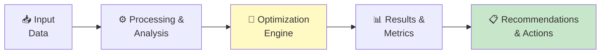

# 💰 Standard Costing System

<p align="center">
  
  
  
  
</p>


*Tracing costs to their causal drivers for accurate product and customer costing*

---

## 📋 Overview

**Standard Costing System** addresses a critical challenge in modern supply chain management: cost management. This implementation combines rigorous academic methodology with production-ready Python code, suitable for both research and enterprise deployment.

Built on the foundational work of **Professor Charles Horngren**, this tool provides supply chain professionals with an analytical framework that transforms raw operational data into actionable optimization decisions. Whether you're managing a single warehouse or a global multi-echelon network, this toolkit scales to your complexity.

The solution follows industry best practices from APICS/ASCM, CSCMP, and ISM frameworks, implemented with clean, extensible Python code that integrates with existing ERP, WMS, and TMS systems.

**Key capabilities:**
- Activity-based costing with multi-level cost pools
- Product-level and customer-level profitability analysis
- Standard vs. actual variance decomposition
- Cost driver identification and rate computation
- Profitability waterfall visualization

---

## 🏗️ Architecture



---

## ❗ Problem Statement

### The Challenge

Supply chain cost management is a persistent operational challenge that impacts cost, service, and working capital across the enterprise. Organizations that fail to optimize cost management typically see:

| Impact Area | Without Optimization | With Optimization | Improvement |
|-------------|---------------------|-------------------|-------------|
| **Cost** | Baseline | 15-30% reduction | Significant |
| **Service Level** | 85-90% | 95-99% | +5-14 pts |
| **Working Capital** | Over-invested | Right-sized | 20-40% freed |
| **Decision Speed** | Days/weeks | Minutes/hours | 10-50x faster |

> *"The goal is not to optimize individual functions, but to optimize the entire supply chain system — which often means sub-optimizing individual nodes for the benefit of the whole."*

---

## ✅ Solution Methodology

### Methodology

This implementation follows a structured analytical approach:

1. **Data Ingestion & Validation** — Load operational data, validate completeness, handle missing values and outliers
2. **Exploratory Analysis** — Statistical profiling, distribution analysis, correlation identification
3. **Model Construction** — Build the optimization/analytical model with configurable parameters and constraints
4. **Solution Computation** — Execute the algorithm with convergence checking and solution quality metrics
5. **Results & Recommendations** — Generate actionable outputs with sensitivity analysis and implementation guidance

---

## 💻 Quick Start

### Prerequisites

| Requirement | Version |
|-------------|---------|
| Python | 3.8+ |
| pip | Latest |

### Installation

```bash
git clone https://github.com/virbahu/standard-costing-system.git
cd standard-costing-system
pip install -r requirements.txt
python standard_costing_system.py
```

### Usage

```python
# Quick start example
from standard_costing_system import *

# Run with default parameters
result = main()
print(result)

# Customize parameters
# See docstrings in standard_costing_system.py for full parameter reference
```

---

## 📦 Dependencies

```
numpy
scipy
pandas
matplotlib
```

---

## 📚 Academic Foundation

| | |
|---|---|
| **Based on** | Professor Charles Horngren, Stanford |
| **Key Reference** | Horngren et al. (2015) *Cost Accounting: A Managerial Emphasis.* Pearson |
| **Domain** | Cost Management |

---

---

## 👤 Author

**Virbahu Jain** — Founder & CEO, [Quantisage](https://quantisage.com)

> Building the AI Operating System for Scope 3 emissions management and supply chain decarbonization.

| | |
|---|---|
| 🎓 **Education** | MBA, Kellogg School of Management, Northwestern University |
| 🏭 **Experience** | 20+ years across manufacturing, life sciences, energy & public sector |
| 🌍 **Scope** | Supply chain operations on five continents |
| 📝 **Research** | Peer-reviewed publications on AI in sustainable supply chains |

---

## 📄 License

MIT License — see [LICENSE](LICENSE) for details.

Part of the **Quantisage Open Source Initiative** | AI × Supply Chain × Climate
